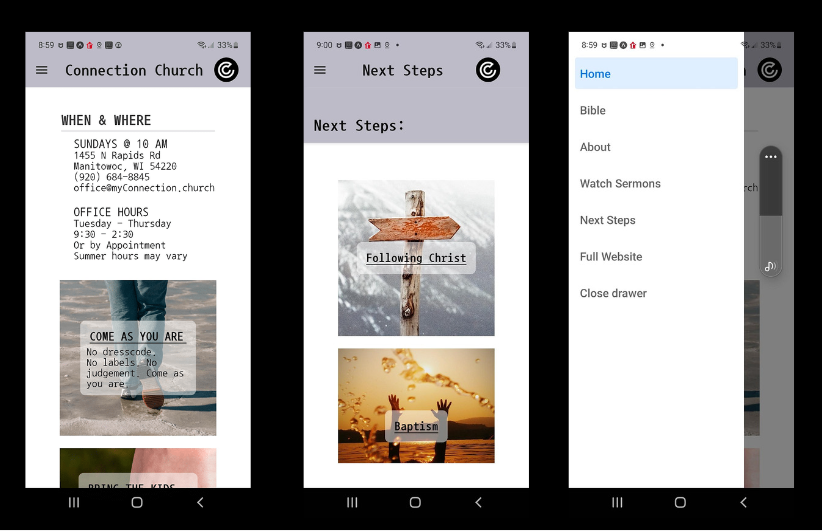

# ConnectionChurchApp
A mobile app created with React-Native Expo to allow users to reach all of the content on the corresponding church web site: email staff, watch sermon videos, read the Bible and find information regarding policies and programs. Status: waiting for client to choose font, photos before adding to app stores. 

## Why I build the project this way
* Expo can manage the different android and ios devices.
* Expo had a component for everything that I needed to add.
* The client requested everything as much like their website as possible.
* The client uses Brezechms forms which integrated easily as a Webview.
* I used Formik with Yup for the one form they had which WIX had handled on their website.

## What I would do if I had more time
* More work on styling.
* Automate testing.

## Available Scripts

In the root directory, you can run Expo Start.

